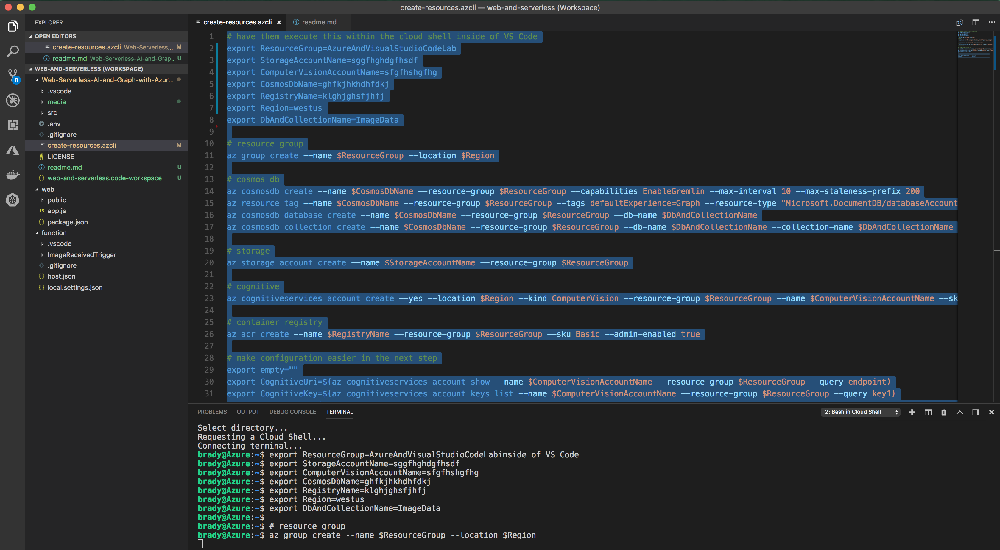
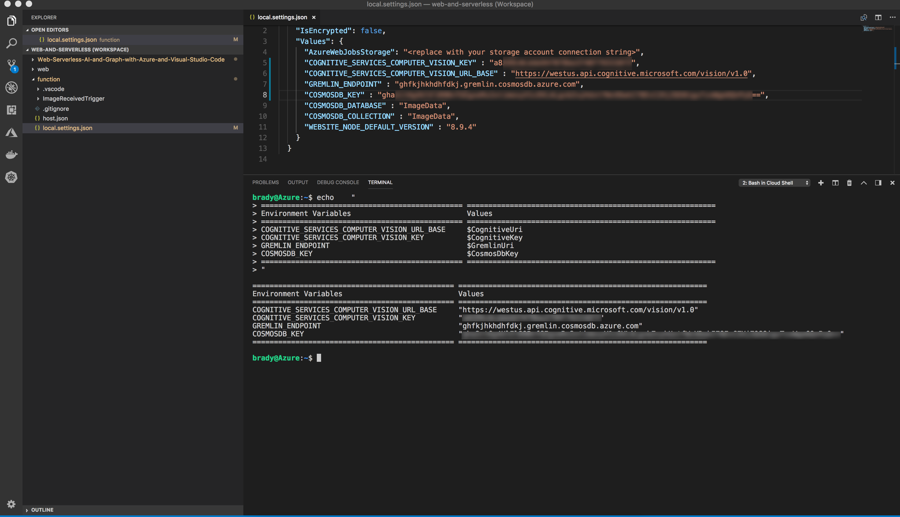

## Prerequisites

## Setup

1. Clone this repository.
1. CD into the directory and type `code .\web-and-serverless.code-workspace`.
1. Log into Azure using Visual Studio Code's **Sign In** command. 

    

1. You'll see a prompt in Visual Studio Code. Click the button and you'll be sent to a login site where you can paste in the login code. 

    

1. Once the browser lets you know you're logged in, flip back to VS Code. 

1. Open the **Azure Cloud Shell** in bash mode by using the `Open Bash in Cloud Shell` command. 

    

1. The Cloud Shell will open a bash terminal in the integrated terminal window in Visual Studio Code. 

    

1. Open the `create-resources.azcli` file and edit the first few lines, to set the variables according to your needs. 

    ```bash
    export ResourceGroup=AzureAndVisualStudioCodeLab
    export StorageAccountName=AzureAndVisualStudioCodeLab
    export ComputerVisionAccountName=AzureAndVisualStudioCodeLab
    export CosmosDbName=AzureAndVisualStudioCodeLab
    export RegistryName=AzureAndVisualStudioCodeLab
    ```

1. Select all of the text in the `.azcli` file, and then use the `Cmd+'` or `Ctrl+'` key to run the code in the terminal. This will pump the code into the Cloud Shell terminal below and start creating the resources you'll need for the lab. 

    


## Configuration

Once the resources have been created, you need to configure the app using Visual Studio Code's Azure features. The files `.env` and `function\host.settings.json` according to the bash script output and by using the Storage extension in Visual Studio Code. 

The screen shot below shows how values would be copied from the terminal window once the script finishes running into the connfiguration file for the Azure Function. 

